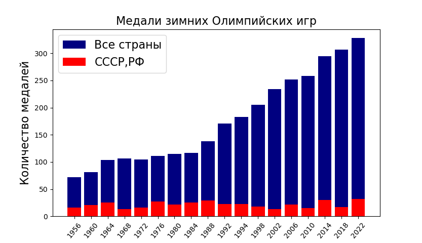
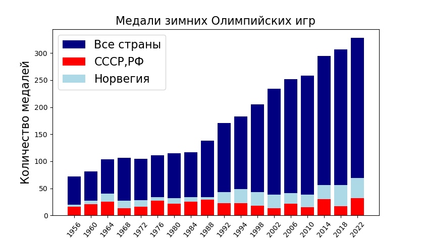
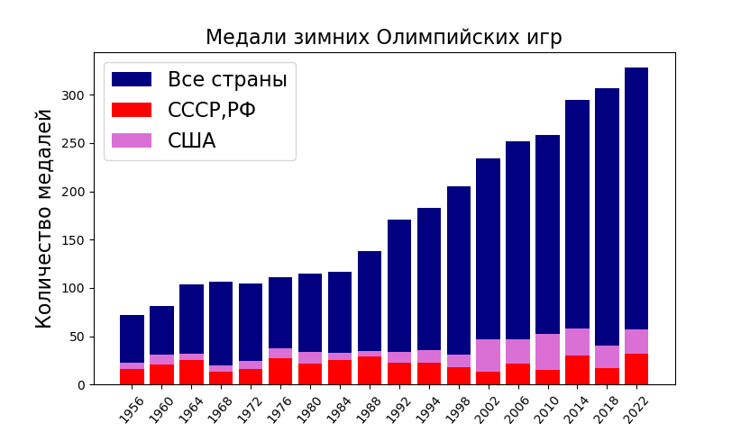
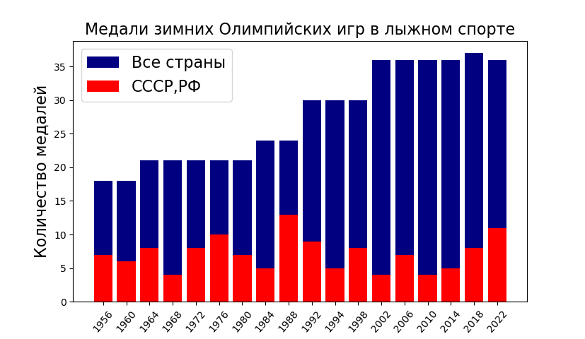
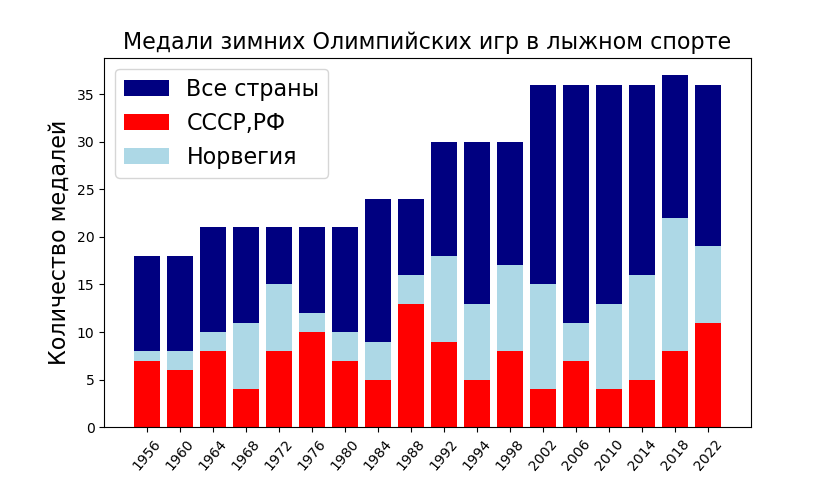
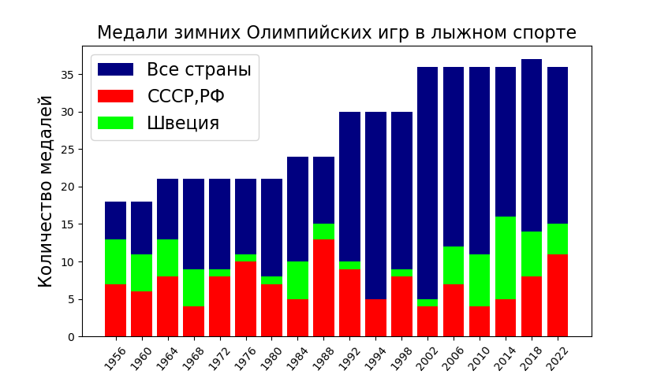

# статистика медалей РФ-СССР на зимних олимпиадах

## Общая медальная таблица:

Исходные данные    
    https://en.wikipedia.org/wiki/1956_Winter_Olympics_medal_table
    ...
    https://en.wikipedia.org/wiki/2022_Winter_Olympics_medal_table

## По лыжным гонкам
    
Исходные данные    
    https://en.wikipedia.org/wiki/Cross-country_skiing_at_the_1956_Winter_Olympics
    ...
    https://en.wikipedia.org/wiki/Cross-country_skiing_at_the_2022_Winter_Olympics

